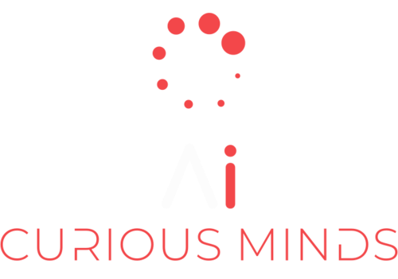

---

# Welcome to the AI Curious Minds community!

---

### 🚀 About Us

We are a dynamic, inclusive community of AI enthusiasts, learners, professionals, passionates and curious minds across the globe. Our community thrives on diversity, exploring the vast realms of artificial intelligence, including Machine Learning, MLOps, Deep Learning, Computer Vision, Natural Language Processing, Large Language Models, Generative AI, Reinforcement Learning, and beyond. Our global members are at the forefront of exchanging cutting-edge knowledge and cultural perspectives, fostering a rich, collaborative environment. 💼 🌍

---

### 🎯 Our Mission

Our mission is to empower humanity for the AI future, paving the way for a future symbiosis between humans and machines. 🤖 👤

---

### 🗒 Strategy & Planning

>[Strategy & Planning](Strategy&Planing)

---

<!---
AI-CM/AI-CM is a ✨ special ✨ repository because its `README.md` (this file) appears on your GitHub profile.
You can click the Preview link to take a look at your changes.
--->
